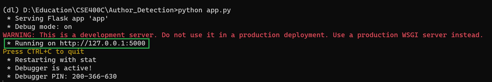

# Author Detection in Bengali Literature

Author detection in Bengali literature is an emerging and promising area that combines the rich literary tradition of Bengali language with computational linguistics and text analysis. Bengali literature has a long history that spans several centuries and is recognized for its lively narrative, poetic language, and variety of literary forms. 
Bengali literature has a diverse range of renowned authors, including Rabindranath Tagore, Kazi Nazrul Islam, Bankim Chandra Chattopadhyay, and Sarat Chandra Chattopadhyay, among many others. 
Now our model will help you to identify the true authorship of the above-mentioned author and also the genre.


## Demo


## Requirements

Things must be installed in your pc:
* python / anaconda distribution
* flask
* numpy
* pickle
* sklearn


## Deployment

To deploy this project go to the Author_Detection directory/folder and open the cmd in that directory.
Then just run the below command.

```bash
  python app.py
```



Now click on the Deployment server link (Showing in the green box) to open the web app. Bingo, You are done. Now just copy and paste the writings to the input box and click submit to know the authorship and genre (category) of the text.


If Everything is okey then you will see like this.
Enjoy. Don't forget to give star.

